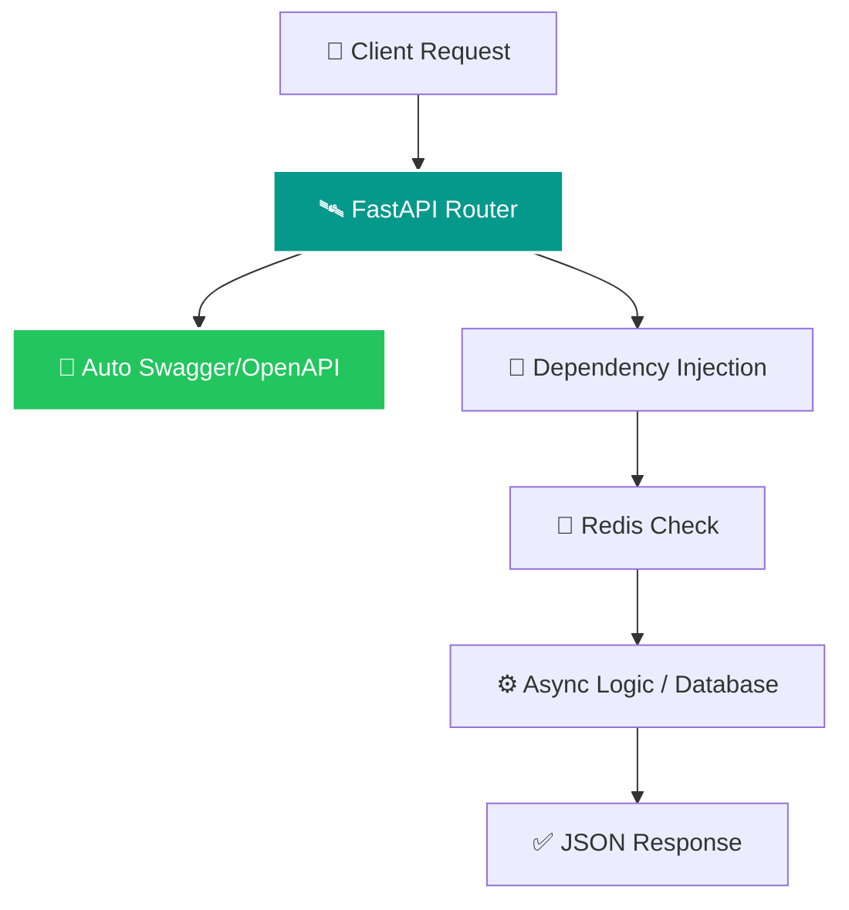
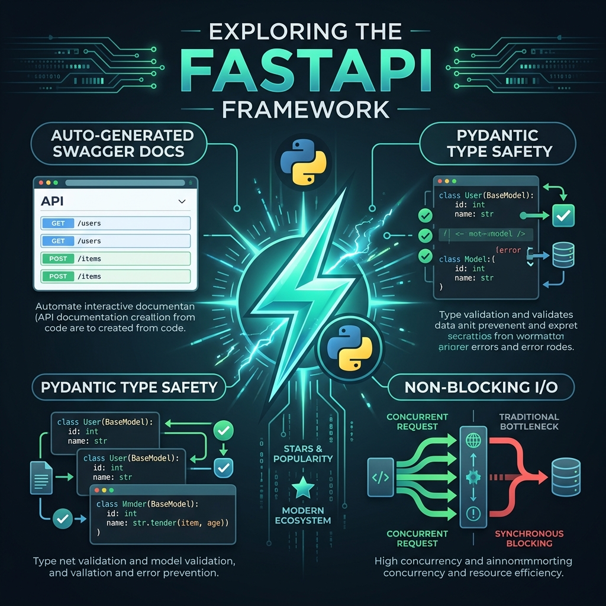

# Understanding FastAPI: The High-Performance Core

FastAPI is a modern, fast (high-performance) web framework for building APIs with Python 3.8+ based on standard Python type hints. It is the central engine of our Enterprise Auth system.

## ⚡ The FastAPI Request Pipeline

## 🚀 Why FastAPI?

### 1. High Performance (Async/Await)
FastAPI is one of the fastest Python frameworks available, on par with **NodeJS** and **Go**. It uses `async` and `await` to handle multiple requests concurrently, meaning your server doesn't "pause" while waiting for a database or Redis response.

### 2. Automatic Documentation
FastAPI automatically generates interactive API documentation using the OpenAPI standard. 
- **Swagger UI**: Try your endpoints in real-time at `/docs`.
- **ReDoc**: Clean, professional documentation at `/redoc`.

### 3. Type Safety with Pydantic
By using Python **Type Hints**, FastAPI ensures that the data coming into your API is exactly what you expect. If a user sends a string where an integer is required, FastAPI rejects it automatically with a helpful error message.

### 4. Dependency Injection
FastAPI has a powerful system for managing reusable logic. In this project, we use it to:
- Inject database sessions (`get_db`).
- Enforce Zero-Trust security (`get_current_user`).
- Handle OAuth2 token extraction.

## 🖼️ FastAPI Performance Infographic

---
## 💡 Pro Tip
FastAPI is built on **Starlette** (for web parts) and **Pydantic** (for data parts), making it both extremely fast and highly reliable for enterprise production.
