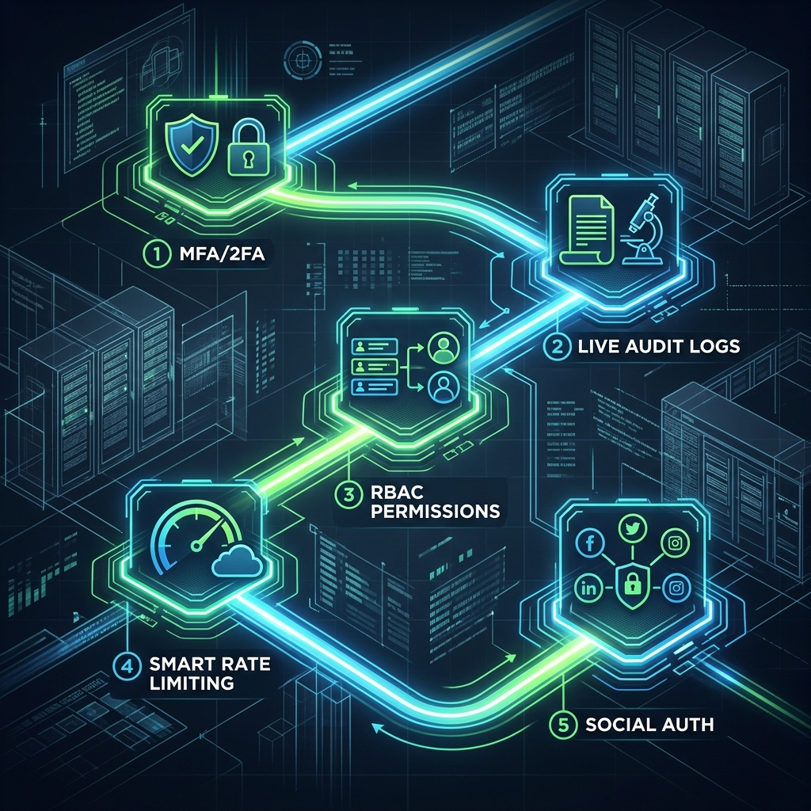

# 🚀 The Road Ahead: Beyond v1.4.2

## 📋 Where we are today
We have built a rock-solid, asynchronous, Zero-Trust foundation. The system is compliant, tested, and secure. But an Enterprise system is never "done"—it evolves.

---

## 🏗️ Future Innovations: The Next 5 Steps

### 1. Multi-Factor Authentication (MFA/2FA)
*   **The Concept**: Passwords are no longer enough.
*   **Next Move**: Integrate `pyotp` to allow users to scan a QR code and enter a 6-digit code from Google Authenticator.

### 2. Live Security Audit Ledger
*   **The Concept**: Who changed what, and when?
*   **Next Move**: Create an `AuditLog` table and a background task that records every login, policy change, and failed authentication attempt for compliance reviews.

### 3. Granular RBAC (Role-Based Access Control)
*   **The Concept**: Not everyone is a "Superuser," but many need permissions.
*   **Next Move**: Expand the `User` model to include `roles` and `permissions`, allowing you to define "Managers," "Viewers," and "Auditors."

### 4. Smart Rate Limiting
*   **The Concept**: Stop brute-force attacks before they happen.
*   **Next Move**: Use Redis to track the number of failed login attempts per IP address and automatically block malicious traffic for 15 minutes.

### 5. Social Auth & SSO
*   **The Concept**: Make it easier for users to join.
*   **Next Move**: Add Google/GitHub/Microsoft identity providers, while still using our Zero-Trust JWT logic for the internal session.

---

### 🚀 Summary
> "A great foundation is the most important part of any building. Now that your foundation is 100% compliant and tested, you can build any feature you can imagine on top of it."
