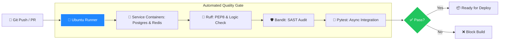
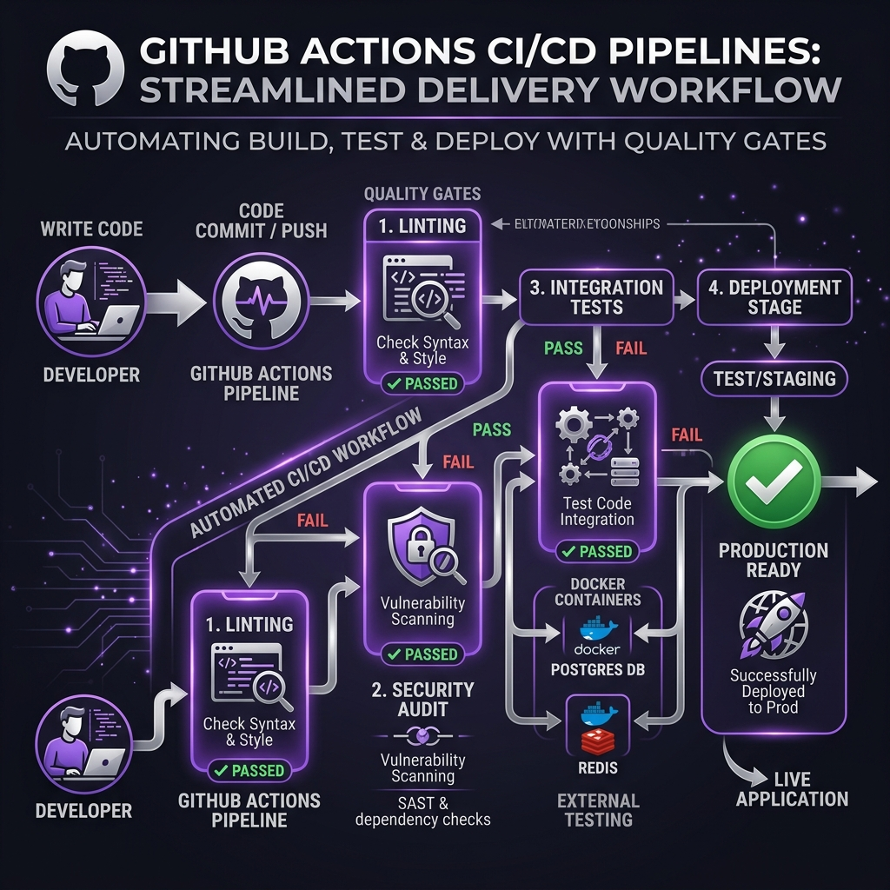

# Understanding GitHub Actions: The Automated Quality Gate

GitHub Actions is a continuous integration and continuous delivery (CI/CD) platform that allows you to automate your build, test, and deployment pipeline. In our system, it ensures that no code reaches production unless it meets the v1.4.2 strict compliance standards.

## 🛡️ The CI/CD Pipeline Flow

## 🚀 Core Concepts

### 1. Runners & Jobs
A **Runner** is a virtual machine (like `ubuntu-latest`) that GitHub spins up to execute your code. A **Job** is a series of steps (like "Install Python" or "Run Tests") that the runner performs.

### 2. Service Containers
To test an Enterprise Auth system, we need a real database and cache. GitHub Actions allows us to spin up **Service Containers** (Dockerized Postgres and Redis) alongside our code, ensuring the test environment matches production exactly.

### 3. Static Analysis (Linting & SAST)
- **Ruff**: Checks for "smelly code," unused variables, and style violations.
- **Bandit (SAST)**: Specifically looks for security flaws, such as hardcoded secrets or weak cryptographic algorithms (HS256 is enforced).

### 4. Workflow Secrets
We never hardcode API keys or passwords. GitHub Actions allows us to store sensitive data in **Encrypted Secrets**, which are injected into the runner's environment safely during execution.

## 🖼️ GitHub Actions Pipeline Infographic

---
## 💡 Why This Matters?
Automated Quality Gates prevent "human error" from introducing security vulnerabilities. If a developer accidentally removes a Zero-Trust check, the **GitHub Actions** pipeline will catch it and block the deployment automatically.
