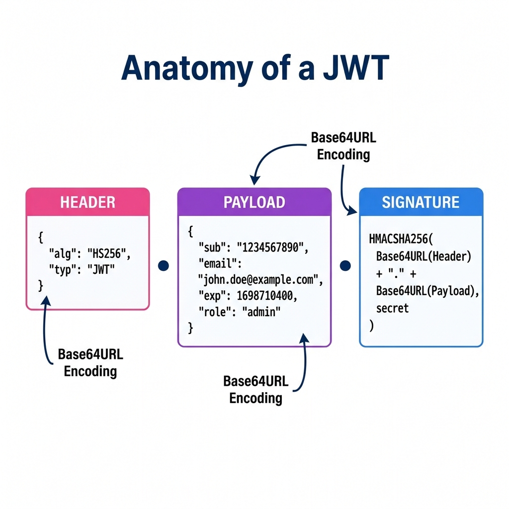

# 🧬 Decoding the JWT: The DNA of Modern Auth

## 📋 What is a JWT?
A **JSON Web Token (JWT)** is an open standard that defines a compact and self-contained way for securely transmitting information between parties as a JSON object. This information can be verified and trusted because it is digitally signed.

---

## 🏗️ The Three Parts of a JWT

### 1. The Header (The Metadata)
The header typically consists of two parts: the type of the token, which is JWT, and the signing algorithm being used, such as HMAC SHA256 or RSA.
*   **Example**: `{"alg": "HS256", "typ": "JWT"}`

### 2. The Payload (The "Cargo")
The payload contains the **claims**. Claims are statements about an entity (typically, the user) and additional data.
*   **sub**: Subject (User ID)
*   **email**: User's email
*   **exp**: Expiration time (The critical timestamp for our TTL policy!)
*   **is_superuser**: User's privileges

### 3. The Signature (The Security Seal)
To create the signature part you have to take the encoded header, the encoded payload, a secret, the algorithm specified in the header, and sign that.
*   **The Secret**: In our project, this is the `SECRET_KEY` in your `.env` file. If a hacker changes the Payload, the Signature will no longer match, and the server will reject the token!

---

## 🔒 Why is it "Stateless"?
Unlike traditional sessions, the server **does not store** the JWT. 
*   Everything the server needs to know (User ID, Expiry, Permissions) is already inside the token. 
*   This makes our FastAPI backend incredibly fast because it doesn't have to check the database for every single request—it just verifies the signature!

---

### 🚀 Summary
> "A JWT is like a sealed envelope. You can see what's on the outside (Base64), but if you try to change the letter inside without a new seal (the Signature), the recipient will know immediately."
