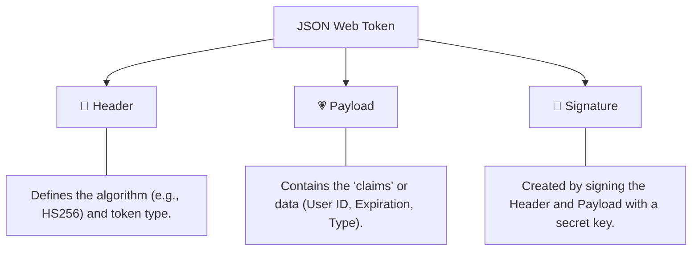

# Understanding JWT: JSON Web Tokens

A JSON Web Token (JWT) is an open standard that defines a compact and self-contained way for securely transmitting information between parties as a JSON object. This information can be verified and trusted because it is digitally signed.

## 🧱 The Anatomy of a JWT

A JWT is composed of three parts separated by dots (`.`):



### 1. Header
The header typically consists of two parts: the type of the token, which is JWT, and the signing algorithm being used, such as HMAC SHA256 or RSA.
```json
{
  "alg": "HS256",
  "typ": "JWT"
}
```

### 2. Payload
The second part of the token is the payload, which contains the claims. Claims are statements about an entity (typically, the user) and additional data.
```json
{
  "sub": "1",
  "type": "access",
  "exp": 1715714400
}
```

### 3. Signature
To create the signature part you have to take the encoded header, the encoded payload, a secret, the algorithm specified in the header, and sign that.
```javascript
HMACSHA256(
  base64UrlEncode(header) + "." +
  base64UrlEncode(payload),
  secret_key
)
```

## 🖼️ JWT Structure Infographic


---
## 💡 Why JWT for Enterprise Auth?
- **Stateless**: The server doesn't need to store session data in a database for every user.
- **Portable**: Can be used across multiple domains or microservices easily.
- **Secure**: The signature ensures that the payload hasn't been tampered with by a malicious user.
