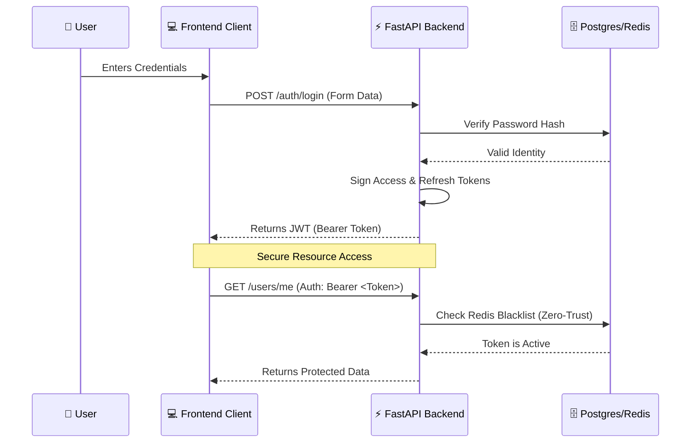
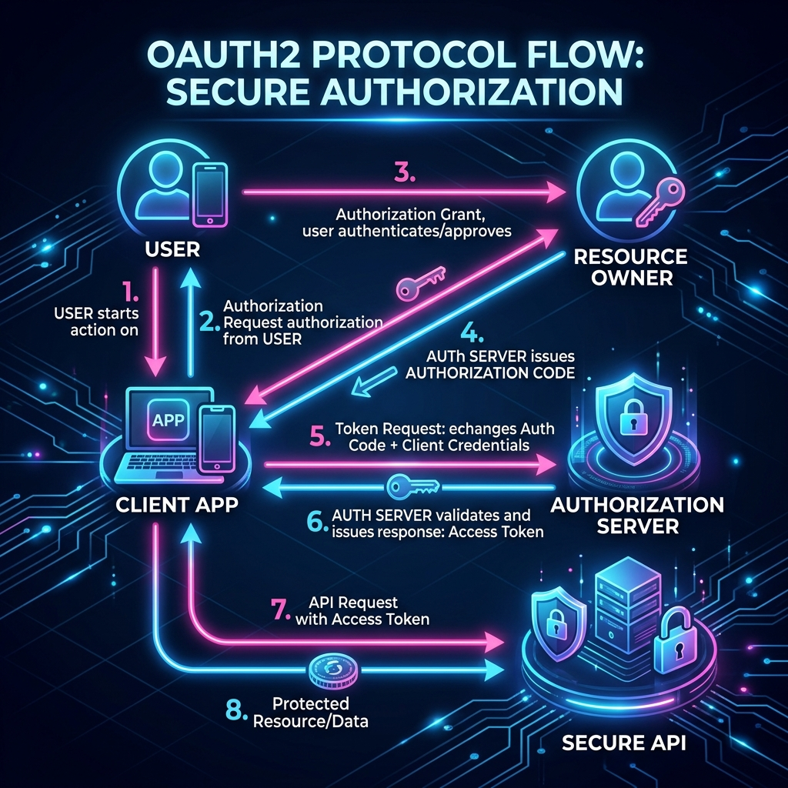

# Understanding OAuth2: The Enterprise Standard

OAuth2 is the protocol that powers secure authentication and authorization in modern web systems. It allows a "Client" (your frontend) to access a "Resource" (your user data) on behalf of a "Resource Owner" (the user) using **Tokens** instead of passwords.

## 📊 The OAuth2 Flow in This System

## 🗝️ Key Concepts

1.  **Bearer Token**: A security token that gives "the bearer" access to a resource. It is sent in the HTTP `Authorization` header.
2.  **Access Token**: A short-lived credential (15 minutes) used to access protected data.
3.  **Refresh Token**: A long-lived credential (7 days) used to obtain a new Access Token without the user logging in again.
4.  **Zero-Trust**: The principle of "never trust, always verify." In our system, this means checking the **Redis Blacklist** for every single request, even if the token signature is valid.

## 🖼️ Infographic Guide

---
*Created for the Enterprise Core Auth v1.4.2 Learning Module.*
