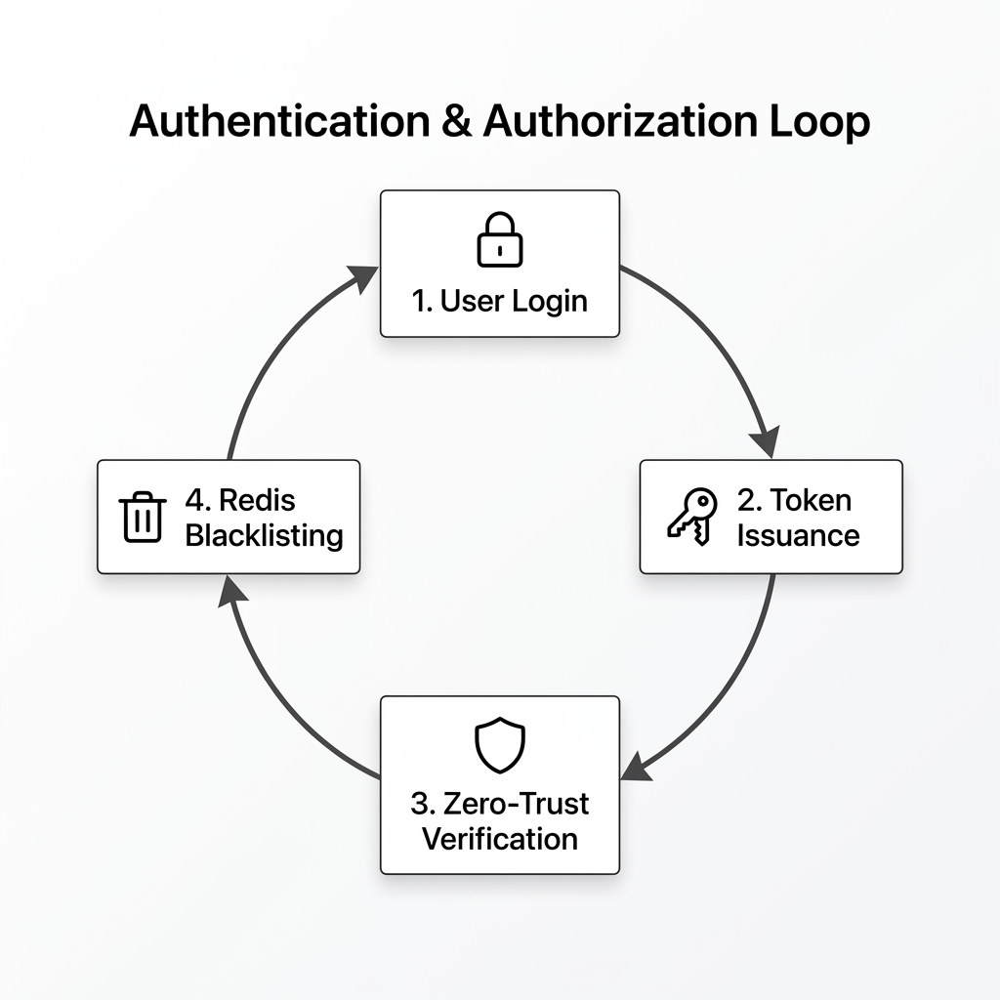

# Enterprise Core-Auth: Project Procedure & Lifecycle

This document defines the high-performance security lifecycle implemented in the v1.4.2 Enterprise Auth System.

## 1. Secure Identity Birth (Registration)
*   **Hardware Anchoring**: During registration, the system captures a **Device Fingerprint** (unique hardware signature).
*   **Hashing**: Passwords never enter the database in plain text; they are salted and hashed using `bcrypt` (PEP8 & Security compliant).

## 2. Multi-Factor Handshake (Login)
*   **Dual-Token Issuance**: Successful login generates two tokens:
    *   **Access Token**: Short-lived (15 min) for authorized API calls.
    *   **Refresh Token**: Long-lived (7 days) for session persistence.
*   **Cryptographic Binding**: The hardware fingerprint is signed directly into the JWT payload, binding that token to that specific device.

## 3. Zero-Trust Verification (Validation)
*   **Identity Drift Detection**: On every request, the backend compares the incoming hardware signature with the one inside the token.
*   **Auto-Kill**: If a token is presented from a different device, the system assumes a "Stolen Token" scenario and automatically triggers a global revocation.

## 4. Stateful Revocation Layer (Blacklisting)
*   **Redis Acceleration**: Unlike standard JWTs, our system uses a high-speed Redis layer to track "killed" tokens.
*   **Instant Disconnect**: When a user logs out or a security breach is detected, the token is added to the **Stateful Blacklist**, rendering it useless immediately.

## 5. Silent Healing (Auto-Rotation)
*   **Background Maintenance**: The frontend monitors token life. Before an Access Token expires, it performs a silent refresh in the background.
*   **Session Continuity**: This allows for maximum security without forcing the user to log in repeatedly.

---
*Created for: Project Core-Auth Spec v1.4.2*
