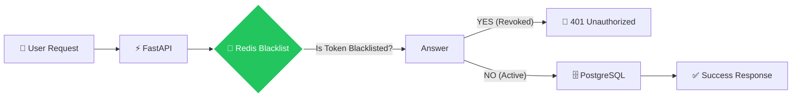
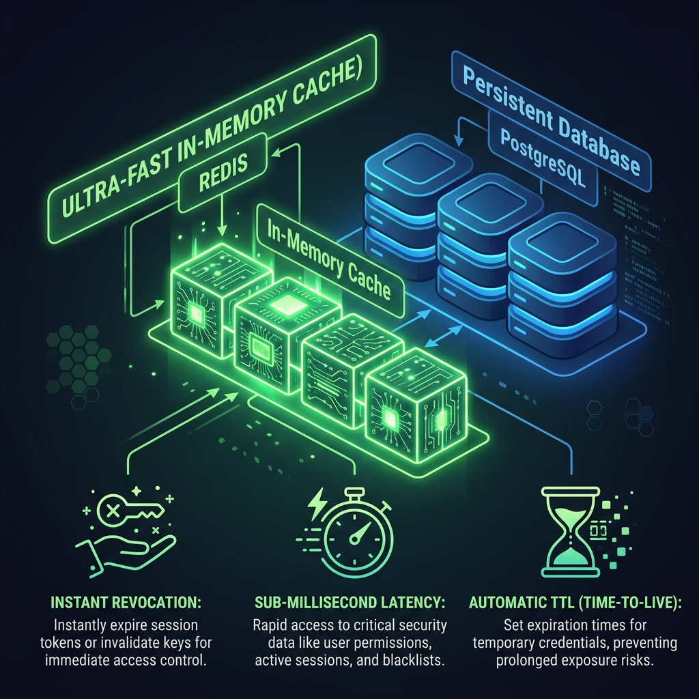

# Understanding Redis: The Fast Memory Layer

Redis (Remote Dictionary Server) is an open-source, in-memory data structure store. In our Enterprise Auth system, it serves as the **Stateful Security Gatekeeper**, providing the speed necessary for real-time token validation.

## 🛡️ Redis in the Auth Lifecycle

## 🚀 Key Concepts in This System

### 1. Sub-Millisecond Latency
Because Redis stores data in RAM (not on a disk), it can verify if a token is blacklisted in less than **1 millisecond**. This ensures that our "Zero-Trust" check doesn't slow down the user experience.

### 2. Time-To-Live (TTL)
We don't need to keep a revoked token in the blacklist forever—only until its original expiration time. 
- **The Logic**: If a token was set to expire in 10 minutes, we set a 10-minute **TTL** in Redis.
- **The Benefit**: Redis automatically deletes the record when the time is up, keeping our memory usage extremely low.

### 3. Stateful Revocation
JWTs are naturally stateless (self-contained). Redis adds a "Stateful" layer, allowing us to:
- **Logout Users Instantly**: Kill a session immediately.
- **Emergency Lockout**: Block specific compromised tokens without affecting other users.

## 🖼️ Redis Security Infographic

---
## 💡 Pro Tip
In production, Redis is often used for more than just blacklisting, including **Rate Limiting** (preventing brute-force attacks) and **Session Caching**.
