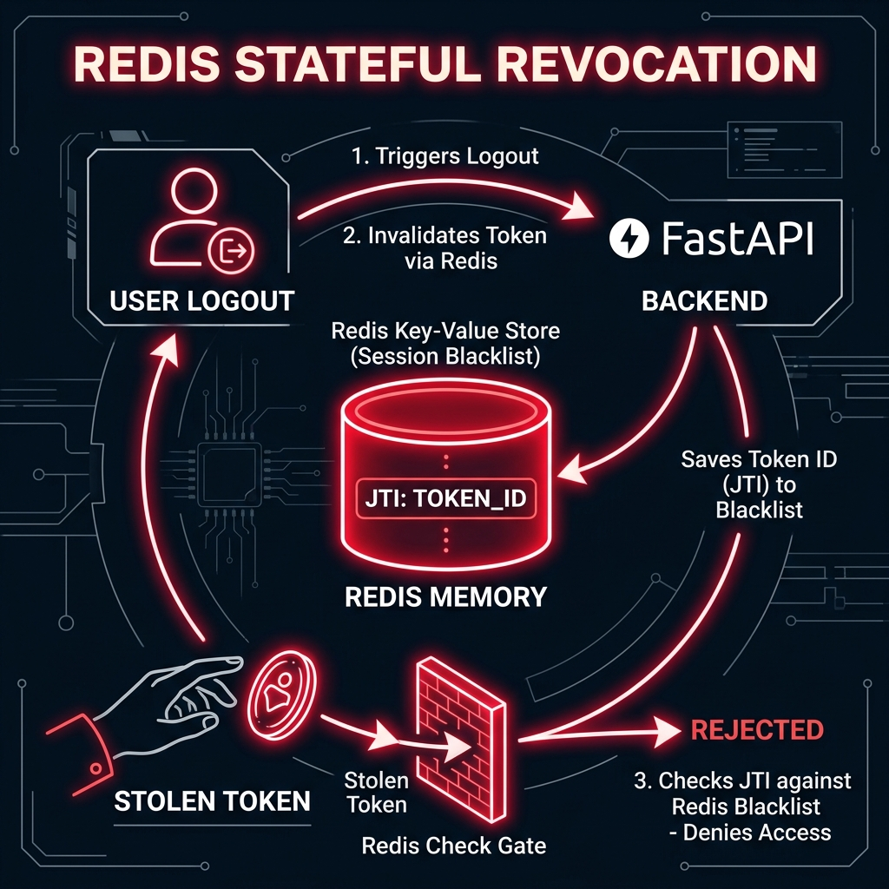

# ⚡ Redis: The Stateful Guard of Zero-Trust

## 📋 What is Redis?
**Redis** (Remote Dictionary Server) is an open-source, in-memory data structure store. In our Enterprise Auth system, it acts as a high-speed "Blacklist" to manage token revocation.

---

## 🏗️ Why do we need Redis for JWTs?
JWTs are "Stateless," meaning once they are issued, they are valid until they expire. 
*   **The Problem**: What if a user logs out early? Or what if an Admin disables an account? The token would still be valid in the browser until its `exp` time hits.
*   **The Solution**: Redis! We store the `jti` (Unique Token ID) of any "Logged Out" or "Revoked" token in Redis until its natural expiry time.

---

## 🛡️ The Zero-Trust Check
Every time a user makes a request to our FastAPI backend:
1.  **JWT Verification**: The server checks the signature (is it a real token?).
2.  **Redis Check**: The server asks Redis: *"Is this specific Token ID on your Blacklist?"*
3.  **Instant Rejection**: If Redis says "YES," the user is kicked out immediately, even if the token has 10 minutes left!

---

## 🚀 Why Redis and not a Database (SQL)?
1.  **In-Memory Speed**: Redis stores data in RAM, not on a hard drive. It can check a token in less than **1 millisecond**.
2.  **Auto-Expiration**: We tell Redis to delete the token ID automatically once its original `exp` time is reached. This keeps our memory clean and efficient.
3.  **Fail-Safe Design**: As you've seen in our project, our `redis_service` is designed to be "Fail-Fast"—if Redis is down, the system continues in "Safety Mode" without crashing!

---

### 🚀 Summary
> "Redis is the 'Bouncer' at the door. Even if you have a valid ticket (JWT), the Bouncer checks his list to see if you've been banned before letting you in."
