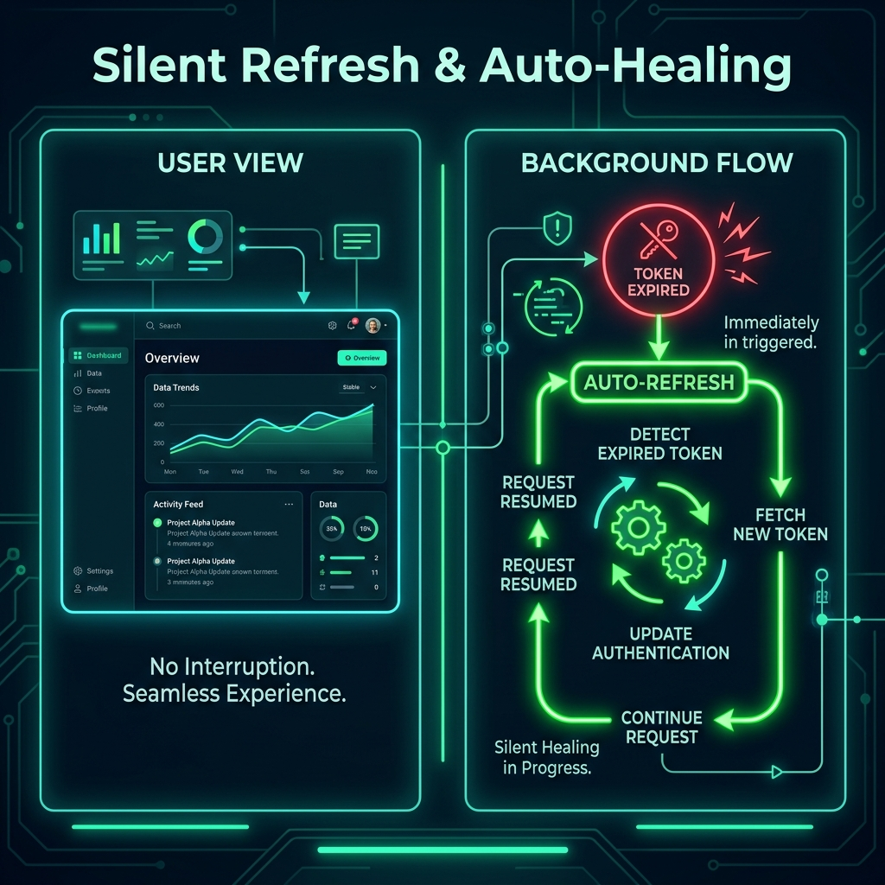

# 🔄 Silent Refresh: The Art of Auto-Healing Sessions

## 📋 What is a Silent Refresh?
A **Silent Refresh** is a background process where the frontend automatically detects that an Access Token is about to expire (or has just expired) and uses a **Refresh Token** to get a new one without interrupting the user.

---

## 🏗️ Why is it "Auto-Healing"?
In older systems, when your session expired, you would be kicked out to the login page, losing your unsaved work. Our "Auto-Healing" approach prevents this.

### The 3-Step Healing Process:
1.  **Detection**: The frontend (browser) sees a `401 Unauthorized` error or notices the timer is at zero.
2.  **Rotation**: It immediately sends the long-lived **Refresh Token** to the `/auth/refresh` endpoint.
3.  **Resumption**: The backend issues a new Access Token, and the frontend **retries the failed request** automatically. The user never sees an error message!

---

## 🛡️ Security vs. UX
*   **The UX Win**: The user stays logged in forever (as long as they are active), creating a "Premium" feel like Gmail or Slack.
*   **The Security Win**: Even though the session feels long, we are actually rotating tokens every 15 minutes. This means we are constantly re-verifying the user's status, permissions, and TTL policy.

---

## ⚙️ Implementation in our Project
You can see this logic in action in `index.html` and `users.html`:
*   `fetchProfile` has a "Retry" mechanism.
*   `rotateToken` is called automatically when the timer hits zero.
*   The `localStorage` is updated in the background, keeping the session "alive."

---

### 🚀 Summary
> "Silent Refresh is like mid-air refueling for a jet. The mission never stops, but the fuel (the Token) is constantly being replenished in the background."
