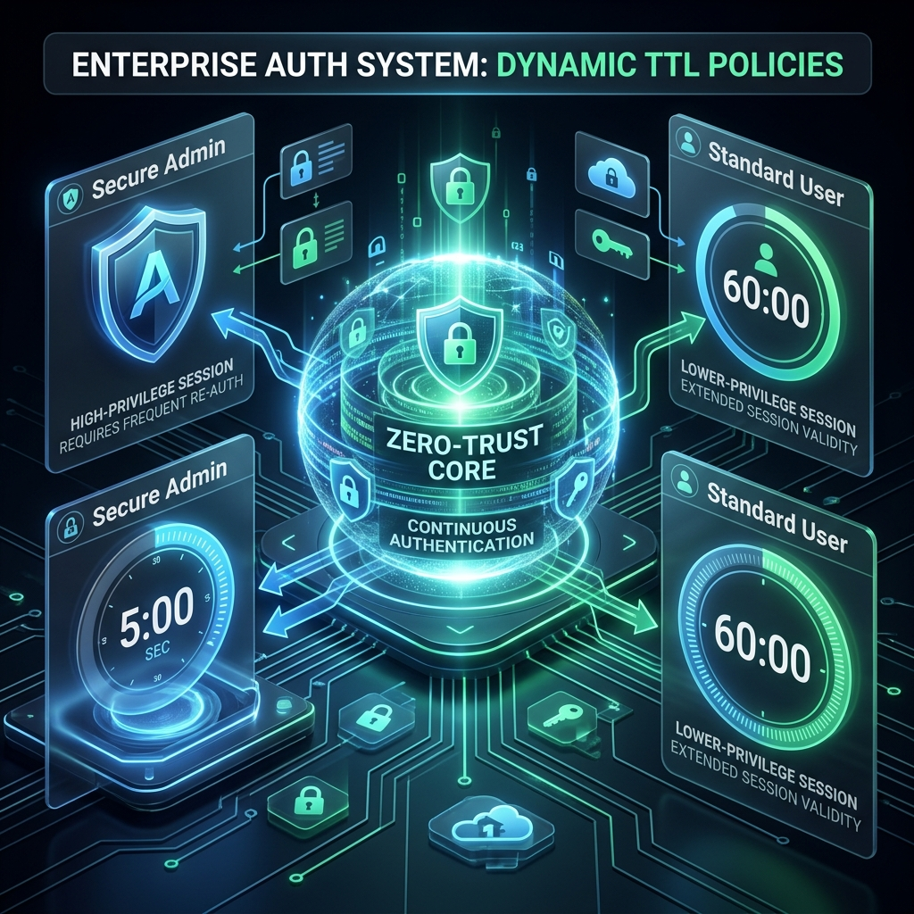
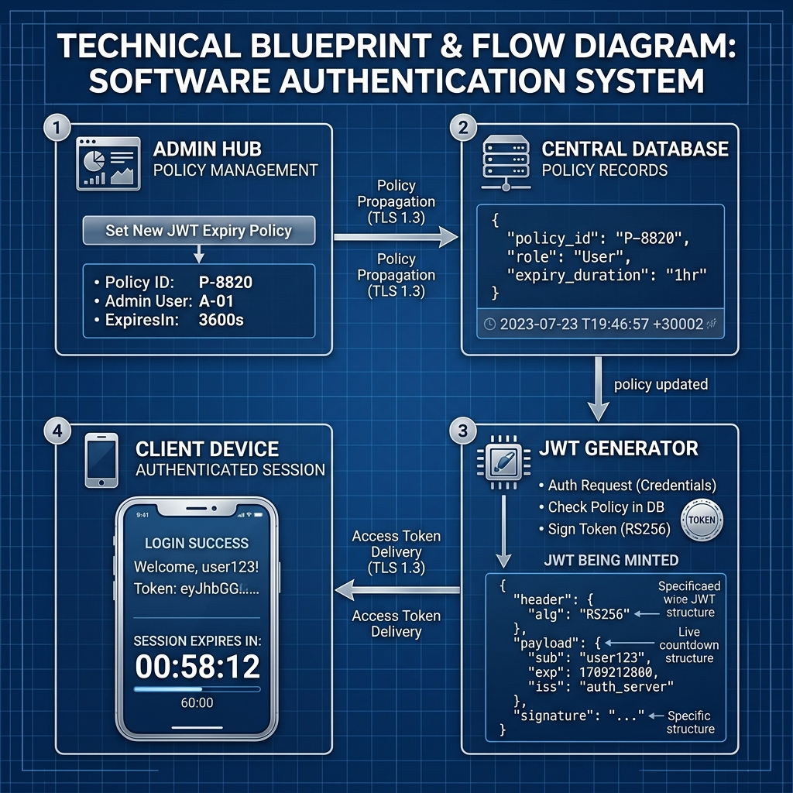
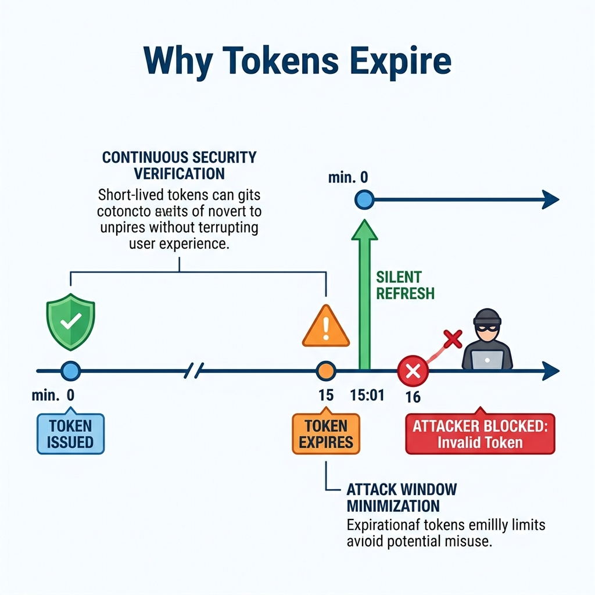

# 🛡️ Mastering TTL Policies in Enterprise Auth

*The conceptual balance between security and user experience.*

## 📋 What is a TTL Policy?
**TTL (Time-To-Live)** defines the lifespan of a security token. In our system, the **Access Token TTL** determines how long a user can access protected data before their session must be "rotated" or refreshed.

---

## 🌍 Real-World Use Cases: Why set user-wise TTL?

### 1. The "High-Value Target" (Short TTL: 5-15m)
**Example:** CFO, System Administrator, or DevOps Engineer.
*   **The Risk**: These accounts have "the keys to the kingdom." If their session token is stolen (via XSS or a stolen laptop), an attacker has full access.
*   **The Solution**: By setting a **5-minute TTL**, we force a background security check every 300 seconds. If the user is flagged or fired, their access dies almost immediately.

### 2. The "Operational User" (Medium TTL: 30-60m)
**Example:** Sales Reps, Support Staff.
*   **The Goal**: Balance security with productivity.
*   **The Solution**: A **60-minute TTL** reduces the frequency of background network requests, saving battery on mobile devices and providing a smoother experience for users who don't have sensitive administrative permissions.

### 3. "Compliance & Governance" (Hard Policy: 15m)
**Example:** Financial Institutions (PCI-DSS) or Healthcare (HIPAA).
*   **The Requirement**: Many regulations **legally require** sessions to time out after 15 minutes of inactivity.
*   **The Solution**: Use the **"Enforce Global Policy"** button to snap every user in the organization to a compliant 15-minute window instantly.

---

## ⚙️ How Our System Handles This
Our implementation uses a **Dynamic JWT Strategy**:
1.  **Database check**: When logging in, the server checks the `access_token_expires_minutes` override for that specific UID.
2.  **JWT Encoding**: The `exp` (expiry) claim is baked into the token based on the policy.
3.  **Zero-Trust Blacklist**: If you revoke a user, their short-lived token is blacklisted in **Redis**, providing instant "Kill-Switch" capabilities.

---

## 🏗️ The Technical Blueprint: How it Works

*Visualizing the lifecycle of a Dynamic TTL session.*

### The 4-Step Lifecycle:
1.  **Admin Update**: You set a policy in the **Identity Repository**. This immediately updates the `access_token_expires_minutes` column for that UID.
2.  **State Storage**: The policy is stored centrally. Any existing tokens remain valid, but the **next rotation** will pull the new rule.
3.  **Dynamic Minting**: When the user's client performs a "Silent Refresh", the backend sees the new policy and generates a JWT with a revised `exp` (expiry) timestamp.
4.  **Client Monitoring**: The frontend (browser) decodes the new JWT, calculates the remaining time, and starts the **Live Countdown** you see in the dashboard.

---

## 🛑 The "Kill-Switch": Instant Revocation

*Using Redis Blacklisting to destroy access in real-time.*

By combining **Short TTLs** with our **Redis Blacklist**, we create a powerful security "Kill-Switch":
*   **The Problem**: If a token has a 1-hour expiry, an attacker has 60 minutes to act even if you "disable" the user in the database.
*   **The Solution**: 
    1.  We set a **Short TTL** (e.g., 5m) to minimize the window.
    2.  If an emergency occurs, you click **Logout** or **Disable** in the dashboard.
    3.  Our `redis_service` immediately flags the token as **Revoked**.
    4.  Even if the token hasn't reached its expiry time yet, the user is kicked out **instantly**.

---

## 🕒 The Lifecycle: Why do tokens expire?

*The timeline of a secure session.*

Tokens expire for one primary reason: **Damage Control.**

### The Security Benefits:
1.  **Attacker Mitigation**: If a token is stolen at Minute 5, the attacker only has until Minute 15 to use it. After that, they are blocked by the red "X" shown in the diagram.
2.  **Continuous Re-Verification**: At the point of expiry, the "Silent Refresh" (Green Arrow) acts as a security checkpoint. The server re-verifies the user's status before issuing a new token.
3.  **Zero-Trust Compliance**: By forcing regular "check-ins" with the server, we ensure that security is a continuous process, not a one-time event at login.

---

### 🚀 Summary
> "Security is not a one-size-fits-all. By using Dynamic TTL Policies, we protect the crown jewels with short windows, while giving standard users the flexibility they need to stay productive."
